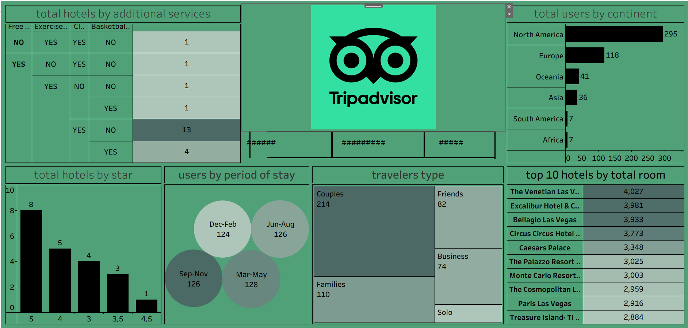

# 🏨 TripAdvisor Hotel Analysis Dashboard

An interactive data visualization dashboard built using Tableau Public,
analyzing hotel data from TripAdvisor.

---

## 📊 Dashboard Overview

This dashboard explores hotel and traveler data including:
- Total hotels by additional services (Free WiFi, Exercise room, etc.)
- Total users by continent
- Hotels categorized by star rating
- Users by period of stay (seasons)
- Traveler types (Couples, Families, Friends, Business, Solo)
- Top 10 hotels by total room count

---

## 🔍 Key Insights

- ⭐ 5-star hotels are the most common (8 hotels)
- 👫 Couples are the most frequent traveler type (214 users)
- 🌍 North America has the highest user count (295 users)
- 🏆 The Venetian Las Vegas leads with 4,027 total rooms
- 📅 Mar-May is the most popular period of stay (128 users)

---

## 🛠️ Tools Used

- Tableau Public
- Microsoft Excel / CSV (data source)

---

## 📁 Files in This Repository

| File | Description |
|------|-------------|
| `dashboard.twbx` | Tableau workbook file |
| `dataset.csv` | Raw dataset used for analysis |
| `dashboard-preview.png` | Screenshot of the dashboard |

---

## 🖼️ Dashboard Preview

---

## 🚀 How to View

1. Download `dashboard.twbx`
2. Open with Tableau Public (free) — [Download here](https://public.tableau.com/en-us/s/download)

**Or view it live here:** [Tableau Public Link]([#](https://public.tableau.com/app/profile/aditi.kunthewar/viz/tripadviserdashboard/Dashboard1)) ← paste your link here

---

## 👤 Author

**Your Name**  
[LinkedIn](#) | [GitHub](#)
